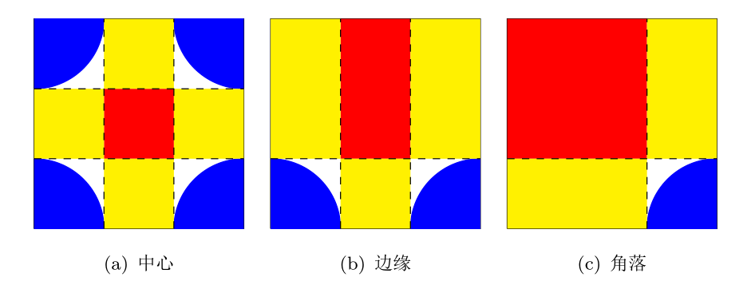

# 数学
## POJ1286
Polya定理。考虑各种情况下的循环节数目：
+ 旋转：旋转i个珠子（$1\le i \le n$），对应的循环节为gcd(n,i)
+ 翻转：
  + 如果珠子的数目是奇数，对称轴一定经过某个珠子，共有n种情况，每种对应的循环节数目均为(n+1)/2
  + 如果珠子的数目是偶数，对称轴可能经过某个珠子（且经过其正对的珠子），共有n/2种情况，每种对应的循环节数目均为n/2+1；对称轴可能不经过某个珠子，共有n/2种情况，每种对应的循环节数目均为n/2
```cpp
#include<iostream>
#include<cstring>
#include<algorithm>
#include<cstdio>
#define N 110


using namespace std;
int gcd(int i, int j) {
	if (j == 0) return i;
	else return gcd(j, i%j);
}

long long power(int x, int k) {
	long long ans = 1;
	for (int i = 0; i < k; i++) ans *= x;
	return ans;
}

int main() {
	int n;
	while (true) {
		cin >> n;
		if (n == -1) break;
		if (n == 0) {
			cout << 0 << endl;
			continue;
		}
		//旋转
		long long sum = 0;
		for (int i = 1; i <= n; i++) {
			sum = sum + power(3, gcd(n, i));
		}
		//翻转
		if (n % 2 == 0) {
			sum = sum + n / 2 * (power(3, n / 2) + power(3, n / 2 + 1));
		}
		else {
			sum = sum + n * power(3, n / 2 + 1);
		}
		sum = sum / (2 * n);
		cout << sum << endl;
	}
	return 0;
}
```

## POJ3270
对于原始数据，要求通过交换将其排序。考虑每一个置换环(环的大小为k)，有下面两种处理方法，选取代价小的一种即可：
+ 取环内的局部最小值lmin进行交换，需要交换k-1次，总代价为$(k-1)*lmin+环内其他元素之和$，即$环内元素总和+(k-2)*lmin$
+ 引入全局最小值gmin，将它和lmin交换，再使用gmin进行(k-1)次交换，最后将gmin换出，总代价为$2*(gmin+lmin)+(k-1)*gmin+环内其他元素之和=环内元素总和+(k+1)*gmin+lmin$


```cpp
#include<iostream>
#include<cstring>
#include<algorithm>
#include<cstdio>
#define N 11000
#define M 110000

using namespace std;

int unorder[N], order[N];
int num[M];
bool visit[N];

int main() {
	int n;
	cin >> n;
	for (int i = 0; i < n; i++) {
		cin >> unorder[i];
		order[i] = unorder[i];
	}
	sort(order, order + n);
	int sum = 0, gmin = M;
	for (int i = 0; i < n; i++) {
		num[order[i]] = i;
		sum += order[i];
		gmin = min(gmin, order[i]);
	}
	for (int i = 0; i < n; i++) {
		if (!visit[i]) {
			int temp = i, k = 0, lmin = M;
			while (!visit[temp]) {
				lmin = min(lmin, unorder[temp]);
				k++;
				visit[temp] = true;
				temp = num[unorder[temp]];
			}
			sum += min(lmin*(k - 2), lmin + gmin * (k + 1));
		}
	}
	cout << sum << endl;
	return 0;
}
```

## POJ1026
加密问题，由于k可能极大，不能直接使用模拟法。原文中的某一位经过若干次循环加密后一定会回到原文，次数就是其所在的循环节的大小。显然，循环节的大小不会超过n。事先求出每一位对应的循环节，只要不改变密码，在加密时只需$O(1)$的时间就可以完成一位加密。

```cpp
#include<iostream>
#include<string>
#include<algorithm>
#include<cstdio>
#define N 210

using namespace std;

int key[N];
char text[N], cipher[N];
int trans[N][N],len[N];
int main() {
	int n, k;
	string s;
	while (true) {
		cin >> n;
		if (n == 0)break;
		for (int i = 1; i <= n; i++) {
			cin >> key[i];
		}
		for (int i = 1; i <= n; i++) {
			trans[i][0] = i;
			int t;
			for (t = 1; t <= n; t++) {
				trans[i][t] = key[trans[i][t - 1]];
				if (trans[i][t] == i) break;
			}
			len[i] = t;
		}
		while (true) {
			cin >> k;
			if (k == 0) break;
			getline(cin, s);
			int m = s.length();
			for (int i = 1; i < m; i++) {
				text[i] = s[i];
			}
			for (int i = m; i <= n; i++) {
				text[i] = ' ';
			}
			for (int i = 1; i <= n; i++) {
				cipher[trans[i][k%len[i]]] = text[i];
			}
			for (int i = 1; i <= n; i++) {
				cout << cipher[i];
			}
			cout << endl;
		}
		cout << endl;
	}
	return 0;
}
```

## POJ3440
m\*n个瓷砖上的所有位置都是可能存在圆心。对不同位置的瓷砖分别考虑，将圆心位置与覆盖瓷砖数目的关系表示为下图。红色代表覆盖一个瓷砖，黄色代表覆盖两个瓷砖，白色代表覆盖三个瓷砖，蓝色代表覆盖四个瓷砖。边缘瓷砖以上方为例，角落瓷砖以左上为例（其他位置可以旋转得到）。  



```cpp
#include<iostream>
#include<cmath>
#include<algorithm>
#include<cstdio>

using namespace std;

double Pi = acos(-1.0),eps=1e-8;
double m, n, t, c, r;
int main() {
	int ncase;
	double area[5];
	scanf("%d", &ncase);
	for (int i = 0; i < ncase; i++) {
		scanf("%lf%lf%lf%lf", &m, &n, &t, &c);
		r = c /(2* t);
		area[4] = Pi * r*r*(m - 1)*(n - 1);
		area[3] = (1 - Pi / 4)*r*r * 4 * (m - 1)*(n - 1);
		area[1] = (1 - 2 * r)*(1 - 2 * r)*(m - 2)*(n - 2) + (1 - r)*(1 - 2 * r)*(m + n - 4) * 2 + (1 - r)*(1 - r) * 4;
		area[2] = m * n - area[4] - area[3] - area[1];
		printf("Case %d:\n", i + 1);
		for (int j = 1; j <= 4; j++) {
			if (j == 1)
				printf("Probability of covering %d tile  = %.4f%%\n", j, 100 * area[j] / (m*n)+eps);
			else
				printf("Probability of covering %d tiles = %.4f%%\n", j, 100 * area[j] / (m*n)+eps);
		}
		printf("\n");
	}
}
```
## POJ3101
题意：已知每一个行星的周期，求他们共线的最短的时间。

分析：每一个行星的角速度为$v_i=2\pi T_i$,选择行星0为参考点，则相对于行星0的角速度为$v^′_i=\frac{2π(T_i−T_0)}{T_iT_0}$,则转动半圈的时间为$T^′_i=\frac{π}{v^′_i}=\frac{T_iT_0}{2(T_i−T_0)}$问题就转化为求T′1,T′2,T′3⋯,T′n−1的最小公倍数

最小公倍数：对于整数的最小公倍数为$LCM(a,b)=a×b/GCD(a,b)$,那么对于分数呢？

结论：$LCM(a/b,c/d)=LCM(a,c)/GCD(b,d)$

由于数据的结果比较的大，所以用高精度算法或者是Java。


## POJ2976
0/1分数规划。这道题目过于坑爹

```cpp
#include <iostream>
#include <algorithm>
using namespace std;

const int MAX_N = 1005;
double p;
struct T {
	int a;
	int b;
	bool operator < (const T & y) {
		return (double)a - p * b > (double)y.a - p * y.b;
	}
}t[MAX_N];

int n, k;
int main() {
	while (true) {
		cin >> n >> k;
		if (!n)	break;
		for (int i = 0; i < n; i++)	cin >> t[i].a;
		for (int i = 0; i < n; i++)	cin >> t[i].b;
		p = 0.5;
		double lp = 0.0;
		while (p - lp > 0.0001 || lp - p > 0.0001) {
			lp = p;
			double x = 0.0, y = 0.0;
			sort(t, t + n);
			for (int i = 0; i < n - k; i++) {
				x += t[i].a;
				y += t[i].b;
			}
			p = x / y;
		}
		cout << (int)(100.0 * p + 0.5) << "\n";
	}
	return 0;
}
```


## POJ3422
最小费用最大流。将每一个格点拆成两个点，如点A拆成$A_1$和$A_2$，构建两条从$A_1$到$A_2$的边，一条边容量为1，费用为格点权重的相反数；另一条边容量为无穷，费用为0。如果格点A可达B，那么构建一条$A_2$到$B_1$的边，容量无穷，费用为0。另外构造超级源点到左上角的边，容量为k，费用为0；构造右下角到超级汇点的边，容量为k，费用为0。

```cpp
#include<iostream>
#include<cstring>
#include<algorithm>
#include<cstdio>
#include<queue>
#define N 110
#define INF 9999999
#define ID(x,y) 2*((x-1)*n+y)-1

using namespace std;
struct edge {
	int u, v, cost, cap, next;
};
int m, n, k, cnt = 0;
int val[N][N];
int dis[2 * N*N], pre[2 * N*N];
bool used[2 * N*N];
edge node[2 * N*N], edges[N*N * 4];

void add(int u, int v, int cost, int cap) {
	edges[cnt] = { u,v,cost,cap,node[u].next };
	node[u].next = cnt;
	cnt++;
	edges[cnt] = { v,u,-cost,0,node[v].next };
	node[v].next = cnt;
	cnt++;
}

bool spfa(int src, int des) {
	queue<int> q;
	memset(pre, -1, sizeof(pre));
	memset(used, 0, sizeof(used));
	for (int i = 0; i <= 2 * n*n + 1; i++) dis[i] = INF;
	dis[src] = 0;
	pre[src] = -1;
	used[src] = true;
	q.push(src);
	while (!q.empty()) {
		int u = q.front();
		q.pop();
		used[u] = false;
		for (int t = node[u].next; t != -1; t = edges[t].next) {
			int v = edges[t].v;
			if (edges[t].cap > 0 && dis[v] > dis[u] + edges[t].cost) {
				dis[v] = dis[u] + edges[t].cost;
				pre[v] = t;
				if (!used[v]) {
					used[v] = true;
					q.push(v);
				}
			}
		}
	}
	return dis[des] < INF;
}

int mcmf(int src, int des) {
	int sum = 0;
	while (spfa(src, des)) {
		int flow = INF;
		for (int t = des; pre[t] != -1; t = edges[pre[t]].u) {
			flow = min(flow, edges[pre[t]].cap);
		}
		for (int t = des; pre[t] != -1; t = edges[pre[t]].u) {
			edges[pre[t]].cap -= flow;
			edges[pre[t] ^ 1].cap += flow;
		}
		sum += (dis[des] * flow);
	}
	return sum;
}

int main() {
	cin >> n >> k;
	for (int i = 1; i <= n; i++) {
		for (int j = 1; j <= n; j++) {
			cin >> val[i][j];
		}
	}
	for (int i = 0; i <= 2 * n*n + 1; i++) {
		node[i].next = -1;
	}
	for (int i = 1; i <= n; i++) {
		for (int j = 1; j <= n; j++) {
			add(ID(i, j), ID(i, j) + 1, -val[i][j], 1);
			add(ID(i, j), ID(i, j) + 1, 0, INF);
			if (i < n) add(ID(i, j) + 1, ID(i + 1, j), 0, INF);
			if (j < n) add(ID(i, j) + 1, ID(i, j + 1), 0, INF);
		}
	}
	add(0, ID(1, 1), 0, k);
	add(ID(n, n) + 1, 2 * n*n + 1, 0, k);
	cout << -mcmf(0, 2 * n*n + 1) << endl;
	return 0;
}
```

## POJ3070
矩阵快速幂。

```cpp
#include<iostream>
#include<cstring>
#include<algorithm>
#include<cstdio>
#define M 10000

using namespace std;

int a[32][2][2];
int ans[2][2];
int n;

void mul(int x[2][2], int y[2][2], int z[2][2]) {
	z[0][0] = (x[0][0] * y[0][0] + x[0][1] * y[1][0]) % M;
	z[0][1] = (x[0][0] * y[0][1] + x[0][1] * y[1][1]) % M;
	z[1][0] = (x[1][0] * y[0][0] + x[1][1] * y[1][0]) % M;
	z[1][1] = (x[1][0] * y[0][1] + x[1][1] * y[1][1]) % M;
}

int main() {
	a[0][0][0] = a[0][0][1] = a[0][1][0] = 1;
	a[0][1][1] = 0;
	for (int i = 1; i < 32; i++) {
		mul(a[i - 1], a[i - 1], a[i]);
	}
	while (true) {
		cin >> n;
		if (n == -1) break;
		ans[0][0] = ans[1][1] = 1;
		ans[0][1] = ans[1][0] = 0;
		int temp[2][2];
		for (int k = 0; k < 32; k++) {
			if (n&(1 << k)) {
				mul(ans, a[k], temp);
				memcpy(ans, temp, sizeof(ans));
			}
		}
		cout << ans[0][1] << endl;
	}
	return 0;
}
```

## POJ3301
固定正方形的方向，不同的方向可以得到不同的最小正方形面积。当正方形进行旋转时，面积是一个单峰函数。使用三分法求解。

```cpp
#include<iostream>
#include<cstring>
#include<algorithm>
#include<cmath>
#include<cstdio>
#define N 40
#define INF 9999999
using namespace std;
int t, n;
int x[N], y[N];
const double pi = acos(-1.0), eps = 1e-12;

double f(double eta) {
	double xx, yy;
	double maxx, maxy, minx, miny;
	maxx = maxy = -INF;
	minx = miny = INF;
	for (int i = 0; i < n; i++) {
		xx = x[i]*cos(eta) - y[i]*sin(eta);
		yy = x[i]*sin(eta) + y[i]*cos(eta);
		maxx = max(maxx, xx);
		minx = min(minx, xx);
		maxy = max(maxy, yy);
		miny = min(miny, yy);
	}
	return max(maxx - minx, maxy - miny);
}

int main() {
	cin >> t;
	while (t--) {
		cin >> n;
		for (int i = 0; i < n; i++) {
			cin >> x[i] >> y[i];
		}
		double l = 0.0, r = pi / 2, m1, m2;
		while (r - l >= eps) {
			m1 = (l + r) / 2.0;
			m2 = (m1 + r) / 2.0;
			if (f(m1) < f(m2)) r = m2;
			else l = m1;
		}
		double ans = f(l);
		ans = ans * ans;
		printf("%.2f\n", ans);
	}
	return 0;
}
```

## POJ1870
以1号格子的中心为原点建立坐标系，X轴和Y轴夹角为60度。将所有10000个格子中心的坐标求出，再计算任意两点间的距离。

在求坐标时，可以自里向外一层一层进行。以原点为第0层，则第k层有6k个点。对每一层而言，都有着六个方向，在第一个方向走k-1步，其他方向都走k步，就可以完成一层，在最后一个方向再走一步就可以进入下一层。

在计算距离时，可以将其中一个点平移到原点，另一个点做同样的平移。如果它在第一象限或第三象限，那么距离就是X坐标绝对值和Y坐标绝对值的和；如果在第二象限或第四象限，距离就是两者的最大值。

```cpp
#include<iostream>
#include<cstring>
#include<algorithm>
#include<cstdlib>
#include<cstdio>
#define N 10010
using namespace std;
int m, n;
int x[N], y[N];
void init() {
	x[1] = y[1] = 0;
	int i = 1;
	int dir[6][2] = { {1,-1}, {0,-1},{-1,0},{-1,1},{0,1},{1,0} };
	for (int k = 1;; k++) {
		x[i + 1] = x[i] + 1;
		y[i + 1] = y[i];
		i++;
		for (int d = 0; d < 6; d++) {
			for (int j = 0; j < k; j++) {
				if (d == 0 && j == 0) continue;
				x[i + 1] = x[i] + dir[d][0];
				y[i + 1] = y[i] + dir[d][1];
				i++;
				if (i >= 10000) return;
			}
		}
	}
}

int main() {
	int ans;
	init();
	while (true) {
		cin >> m >> n;
		if (n + m == 0) break;
		int dx = x[n] - x[m], dy = y[n] - y[m];
		if (dx*dy > 0) ans = abs(dx) + abs(dy);
		else ans = max(abs(dx), abs(dy));
		printf("The distance between cells %d and %d is %d.\n", m, n, ans);
	}
	return 0;
}
```
## POJ3296
目标式如下：
$$
\min \frac{V_r}{V_w+V_1} \prod_{i=2}^{k}\frac{V_r}{V_r+V_i}
$$
在确定$V_1$的前提下，当$V_i(2\le i \le k)$都取相等的值时，上式取最小值。
```cpp
#include<cstdio>

int main() {
    double vb, vw, vr, vc;
    int k, i;
    while(1) {
        scanf("%d %lf %lf %lf %lf", &k, &vb, &vw, &vr, &vc);
        if(k == 0) break;
        if(vb + vw < vr){
            puts("0");
            continue;
        }
        double f = (vb+(k-1)*vr-(k-1)*vw)/k;
        if(f<0) f = 0;
        double leftover = vb-(k-1)*(vc-vr);
        if(f<leftover) f = leftover;
        if(f+vw>vc) f = vc-vw;
        if(f>vb) f= vb;
        double s = 0;
        if(k>1) {
            s = (vb-f)/(k-1);
            if(vr+s > vc) s=vc-vr;
        }
        printf("%d %.2f", k, f);
        for(i = 0; i < k-1; i++) {
            printf(" %.2f", s);
        }
        printf("\n");
    }
    return 0;
}
```

## POJ3286
只需要计算[0..n]中有多少个0即可。考虑0在每一位出现几次（注意0不会在最高位出现，除了0）。在考虑每一位时都将n分解为左中右三个部分。

```cpp
#include<iostream>
#include<cstring>
#include<algorithm>
#include<cstdlib>
#include<cstdio>

using namespace std;

long long f(long long x) {
	if (x < 0) return 0;
	if (x < 10) return 1;
	long long ans = 1;
	for (long long i = 1; i*10 <= x; i = i * 10) {
		int right = x % i;
		int left = x / (i * 10);
		int mid = (x / i) % 10;
		if (mid == 0) {
			ans += (left - 1)*i;
			ans += (right + 1);
		}
		else {
			ans += left * i;
		}
	}
	return ans;
}

int main() {
	long long m,n;
	while (true) {
		cin >> m >> n;
		if (m < 0 && n < 0) break;
		cout << (f(n) - f(m - 1)) << endl;
	}
	return 0;
}
```

## POJ1095
先计算有n个节点的二叉树的数目，a[0]=1。有递推公式：
$$
a[n]=\sum_{i=0}^{n-1}a[i]*a[n-1-i] 
$$

在构造二叉树时，先确定二叉树的节点数目，再使用递归进行构建。在递归时，先确定左右子树的节点数，再按照左子树、根、右子树的顺序输出结果。

```cpp
#include<iostream>
#include<cstring>
#include<algorithm>
#include<cstdlib>
#include<cstdio>
#define N 500100100

using namespace std;
int a[30], sum[30];
void init() {
	a[0] = a[1] = 1;
	sum[1] = 1;
	for (int i = 2;; i++) {
		a[i] = 0;
		for (int j = 0; j <= i - 1; j++) {
			a[i] += a[j] * a[i - 1 - j];
		}
		sum[i] = sum[i - 1] + a[i];
		if (sum[i] > N) break;
	}
}

void f(int id, int cnt) {
	if (cnt == 1) {
		printf("X");
		return;
	}
	int m = id, i;
	for (i = 0; i <= cnt - 1; i++) {
		if (m > a[i] * a[cnt - 1 - i]) m -= a[i] * a[cnt - 1 - i];
		else break;
	}
	int j = cnt - 1 - i;
	if (i != 0) {
		printf("(");
		f((m - 1) / a[j] + 1, i);
		printf(")");
	}
	printf("X");
	if (j != 0) {
		printf("(");
		f((m - 1) % a[j] + 1, j);
		printf(")");
	}
}

int main() {
	int n;
	init();
	while (true) {
		cin >> n;
		if (n == 0) break;
		int cnt;
		for (cnt = 1;; cnt++) {
			if (sum[cnt] >= n) break;
		}
		f(n - sum[cnt - 1], cnt);
		printf("\n");
	}
	return 0;
}
```